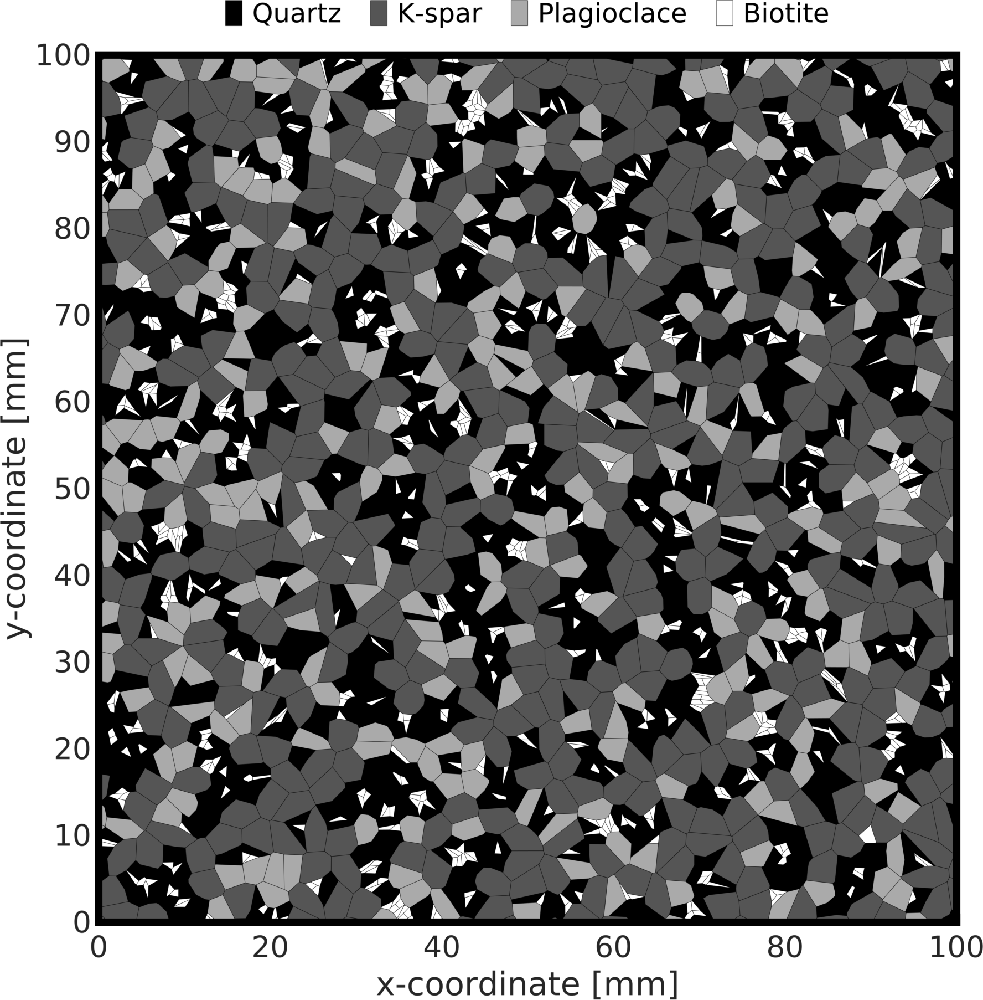
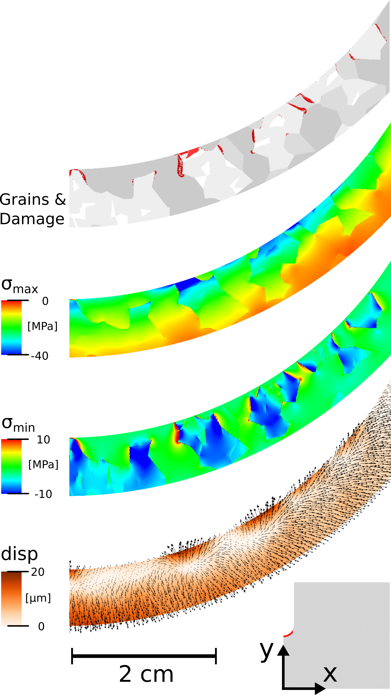

# Thermal Spallation Model
Thermal spallation modeling with [MOOSE](www.github.com/idaholab/moose)

### Files
- simulation files: input files for [MOOSE simulator](www.github.com/idaholab/moose). Investigated are maximum jet flame temperature, solid structure type and heating rate impact.
- input files:
  - pressure_distributions: Stress field
  - temperature_distributions: Temperature distribution along the borehole surface, including heating rate.
  - voronoi_diagrams: Input images for the background matrix and heterogeneous parameters.
- mesh files: .jou file for Trelis/Cubit and smoothed input mesh for simulation files.

### Publications
- Vogler, D., S.D.C. Walsh, Ph. Rudolf von Rohr, and M.O. Saar, Simulation of rock failure modes in thermal spallation drilling, Acta Geotechnica, 15/8, pp. 2327-2340, 2020.  [https://doi.org/10.1007/s11440-020-00927-7](https://doi.org/10.1007/s11440-020-00927-7)

Example material composition

Simulation domain

Grain composition and damage (in red), maximum principal stress, minimum principal stress and heating-induced displacement field (from top to bottom). 
